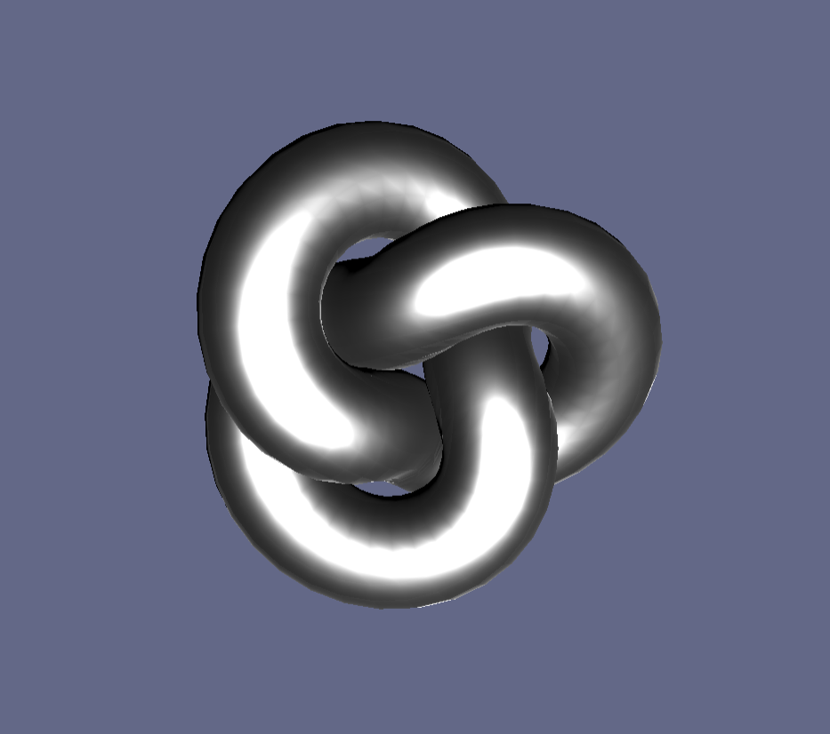

# ThreeJS Quick Start
 A very basic npm project to quickly prototype with Three.js

 This includes a basic JavaScript file that sets up a basic scene:
 - Camera with orbit controls
 - A test mesh to make sure everything works correctly
 - Window resize callback function
 - Render loop and delta time variables

 To use it, clone/download the repository, run "npm install" to download the dependencies, then use "npm run start" to start a local server (using Parcel).

